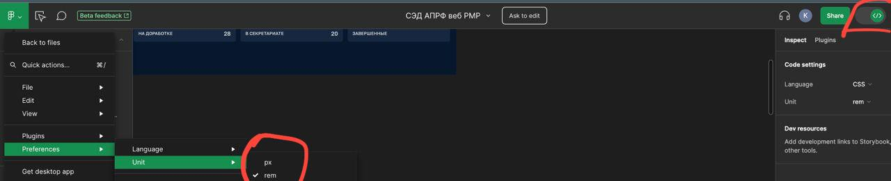

> ## Настройка Figma для использования REM
> 
> 

> ## Установка плагина Tailwind CSS
>
> 

> ## Выбор между фиксированным размером и 100%
>
> Если в вашем макете указано "w 100%", используйте класс `w-full`. Если указан "W Fixed", применяйте размер, указанный в макете.
>
>  

> ## Преобразование размеров
>
> В Tailwind CSS каждый класс имеет свою цифровую характеристику. Одна единица равна `0.25rem`. Например:
>
> ```
> p-1 = padding 0.25rem
> p-2 = padding 0.5rem
> p-3 = padding 0.75rem
> p-4 = padding 1rem
> ```
>
> Чтобы получить значение в **_rem_**, умножьте значение tailwind на 4.

> ## Применение цвета в Tailwind CSS
> 
> В Tailwind CSS цвета можно применять к различным свойствам элемента. Ниже представлены основные способы задания цвета для рамки (border), фона (bg) и текста (text):
>
> ### 1. Рамка (border)
> - Чтобы задать цвет рамки, используйте префикс `border-` перед названием цвета, и цвет `border-1`
>
> ```css
> border-border-1 dark:border-border-1-dark 
> ```
> 
> ### 2. Фон (bg)
> префикс `bg-` и цвет `base-header`
> ```css
> bg-base-header-light dark:bg-base-header-dark
> ```
>  
> ### 3. Текст (text)
> префикс `text-` и цвет `base-header`
> ```css
> text-text-contrast-light dark:text-text-contrast-dark
> ```
>
> #### Также добавляйте префикс `dark:` для реализации темной темы сразу
> 
> ### Где смотреть цвета в figma?
> 

> Вот ваш текст в формате Markdown:


> ## Работа с текстом
> 
> Используйте компонент `Typography` для применения стилей текста:
> ```typescript jsx
> <Typography
> typography="P1"
> className="text-text-contrast-light dark:text-text-contrast-dark">
> {name}
> </Typography>
> <Typography
> typography="P2"
> className="text-text-contrast-light-secondary dark:text-text-contrast-dark-secondary">
> {position}
> </Typography>
> ```
> Значение typography берется из атрибутов в Figma.
> 
> 

> ## Верстка базовых блоков Flex / Grid
> Для создания адаптивных и гибких сеток вы можете использовать компоненты `Flex` и `Grid`. Эти компоненты предоставляют инструменты для настройки и управления расположением дочерних элементов.
> ```typescript jsx
> <Flex 
> justify-content="space-between"
> align-items="center"
> >
> </Flex> 
> <Grid></Grid>
> ```
