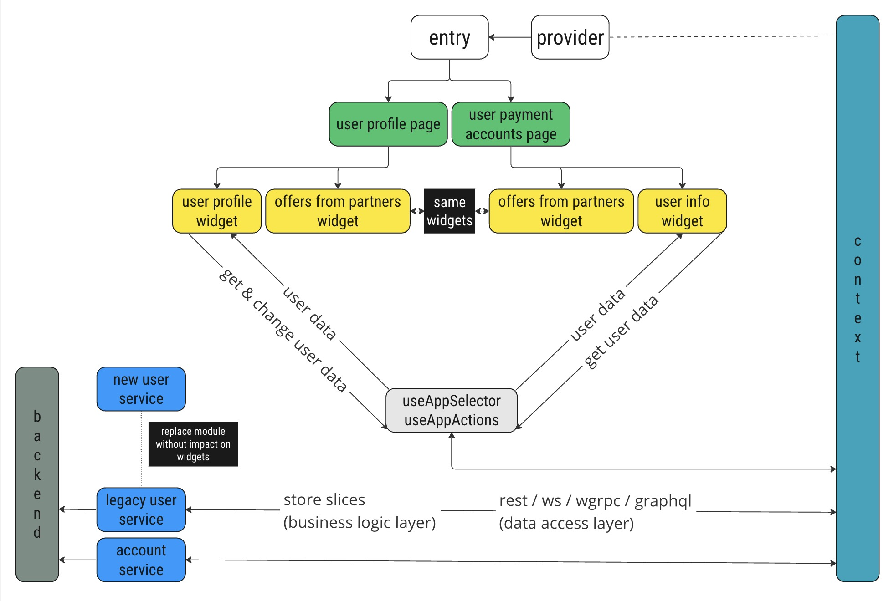
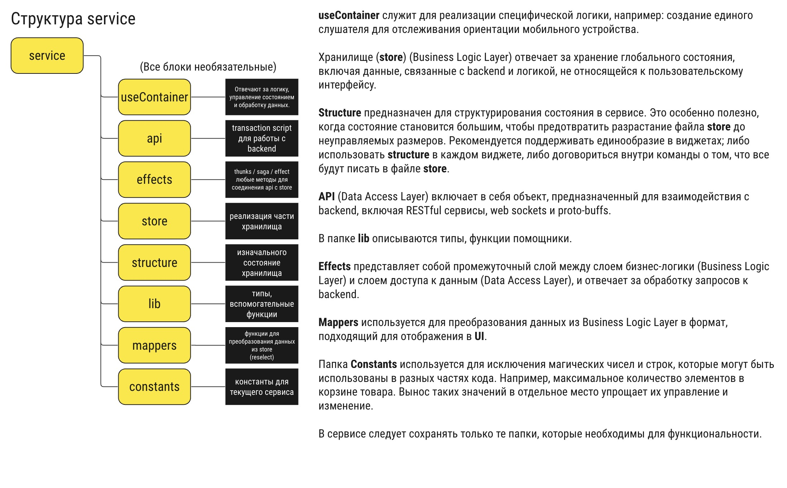

# Архитектура и Структура

> Модульность, упрощают навигацию по коду и ограничивают изменения в рамках одной фичи. Использование слоев обеспечивает
> разделение ответственности и упрощает тестирование и поддержку кода. В проекте показан пример на redux toolkit, но вы
> можете менять технологии как вам вздумается.



> **_App_**: отвечает за настройку и конфигурацию основных аспектов приложения.
>
> Инициализация API, настройка хранилища, объявление и настройка провайдеров, локализация, маршрутизация.


> **_Layouts_**: верстка каркасов приложения.

> **_Pages_**: верстка страницы, объединяющая отдельные логические реализации.

> **_Service_** отвечает за выполнение бизнес-логики без GUI.
>
> **_Service_** могут быть двух типов:
> 1. Логика, отвечающая за извлечение данных с backend и управление их хранением. Обычно эти функции вызываются внутри _**widget**_, но не запрещено вызывать их внутри _**service**_, например для создания функционала валидации сессии.
> 2. Модули, которые не связаны с пользовательским интерфейсом, такие как логирование, определение ориентации экрана и другие вспомогательные задачи.
>
> Все **_service_** должны наименоваться с маленькой буквы в файле index.tsx, чтобы не было совпадений с _**widget**_.
> + **container:** _(необязательно)_ реализация логики;
> + **store:** _(необязательно)_ Business Logic, хранилище данных;
> + **structure:** _(необязательно)_ изначальное состояние store;
> + **api:** _(необязательно)_  Data Access Layer / repository;
> + **effects:** _(необязательно)_ thunks / saga / effects, слой для соединения api и store';
> + **mappers:** _(необязательно)_  Mapping Layer для трансформации данных из Business Logic Layer в UI.
> + **lib:** _(необязательно)_  utility функции, типизация;
> + **constants:** _(необязательно)_ переменные для исключения магических чисел и строк (magic numbers).


<details>
    <summary>
Текст с Изображения
    </summary>

<b>useContainer</b> служит для реализации специфической логики, например: создание единого слушателя для отслеживания ориентации мобильного устройства.

Хранилище <b>(store)</b> (Business Logic Layer) отвечает за хранение глобального состояния, включая данные, связанные с backend и логикой, не относящейся к пользовательскому интерфейсу.

<b>Structure</b> предназначен для структурирования состояния в сервисе. Это особенно полезно, когда состояние становится большим, чтобы предотвратить разрастание файла store до неуправляемых размеров. Рекомендуется поддерживать единообразие в виджетах; либо использовать <b>structure</b> в каждом виджете, либо договориться внутри команды о том, что все будут писать в файле <b>store</b>.

<b>API</b> (Data Access Layer) включает в себя объект, предназначенный для взаимодействия с backend, включая RESTful сервисы, web sockets и proto-buffs.

В папке <b>lib</b> описываются типы, функции помощники.

<b>Effects</b> представляет собой промежуточный слой между слоем бизнес-логики (Business Logic Layer) и слоем доступа к данным (Data Access Layer), и отвечает за обработку запросов к backend.

<b>Mappers</b> используется для преобразования данных из Business Logic Layer в формат, подходящий для отображения в UI.

Папка <b>Constants</b> используется для исключения магических чисел и строк, которые могут быть использованы в разных частях кода. Например, максимальное количество элементов в корзине товара. Вынос таких значений в отдельное место упрощает их управление и изменение.

В сервисе следует сохранять только те папки, которые необходимы для функциональности.
</details>


> **_Generated_** заменяет 99% сервисов по работе с внешними источниками (backend).
>
> Для генерации хуков rtk-query используйте команду:
> ```
> yarn gen:hooks
> ```
> Скрипт автоматически добавит **_reducers_** и **_middleware_** в приложение.

> **_Widget_** представляет модуль, который является строительным блоком для **_pages_**.
>
> Примеры **_widget_**: контекстное меню, список комментариев, видео плеер, информация о видео, панель лайков
>
> Все **_widget_** должны именоваться с большой буквы в файле index.tsx, чтобы не было совпадений с **_service_**.
> + **container/useContainer.ts:** все side effects для ui, мемоизация логики _(Файл useContainer нужен для модульного
    тестирования логики)_;
> + **ui:** чистая компонента, отвечающая только за отрисовку;
> + **templates:** _(необязательно)_  декомпозиция UI для более простого масштабирования приложения в будущем;
> + **store:** _(необязательно)_  Business Logic, хранилище данных, локальное состояния связанное с ui, например:
    координаты контекстного меню;
> + **structure:** _(необязательно)_ изначальное состояние store;
> + **lib:** _(необязательно)_  utility функции, типизация;
> + **constants:** _(необязательно)_ переменные для исключения магических чисел и строк (magic numbers).


<details>
    <summary>
Текст с Изображения
    </summary>

Патерн container/presentation component. Вместо того чтобы принимать props из вне, виджет получает необходимые данные через хук <b>useAppSelector</b> . Взаимодействие с другими сервисами и виджетами, происходит через хук <b>useAppActions</b> .

<b>useContainer</b> содержит всю бизнес-логику и состояние виджета.
Логику можно описать в файле <b>container/index</b> , но это может усложнить тестирование. Рекомендуется использовать <b>useContainer</b>  для изоляции логики.

<b>UI</b> -компонент является чистой функцией, которая принимает данные только через аргументы. Это обеспечивает разделение логики и упрощает мемоизацию. <b>UI</b>  не должен содержать бизнес-логику.

Если файл <b>UI</b>  обрастает слишком большим количеством кода, его можно разбить на подкомпоненты - <b>templates</b> . <b>Templates</b>  должны быть на одном уровне вложенности.

Если какие-то папки внутри виджета не используются или не нужны, их можно удалить.

В папке <b>lib</b>  описываются типы, функции маппинга данных, функции помощники.

Хранилище <b>(store)</b>  используется для хранения глобального состояния, связанного с пользовательским интерфейсом. Примеры такого состояния включают координаты контекстного меню, состояние открытия/закрытия модальных окон и т.д.

<b>Structure</b>  предназначен для структурирования состояния в виджете. Это особенно полезно, когда состояние становится большим, чтобы предотвратить разрастание файла <b>store</b>  до неуправляемых размеров. Рекомендуется поддерживать единообразие в виджетах; либо использовать <b>structure</b>  в каждом виджете, либо договориться внутри команды о том, что все будут писать в файле <b>store</b> .

Папка <b>Constants</b>  используется для исключения магических чисел и строк, которые могут быть использованы в разных частях кода. Например, максимальное количество элементов в корзине товара. Вынос таких значений в отдельное место упрощает их управление и изменение.
</details>


> ## useAppActions
> Хук-адаптер позволяет использовать любые действия для взаимодействия с **_store_**:
> ```javascript
> const { conditionActions: { enqueueNotification } } = useAppActions()
> ```
> Данная реализация позволяет **_изменять_** библиотеку управления состоянием без затрагивания компонент.

> ## useAppSelector
> Хук-адаптер позволяет подписываться на любые изменения store:
> ```javascript
> const { status } = useAppSelector(state => state.condition)
> ```
> Данная реализация позволяет **_изменять_** библиотеку управления состоянием без затрагивания компонент.


> ## Для генерации новых features
>
> В папке рядом с **_package.json_** вызвать команду из пакета **_@npm.piece/template-generator_**:
> ```
> new widget name
> new service name
> ```
>
> ## Для создания feature без инъекции в store (no store)
> ```
> new widget name ns
> new service name ns
> ```
>
> Команда автоматически добавит зависимости в хук _**useAppActions**_ и список **_ReducersList_**.
> ## Для удаления features
> ```
> remove widget name
> remove service name
> ```
> Команда автоматически удалит зависимости из хука _**useAppActions**_ и списка **_ReducersList_**.


> ## Docker
> #### Сборка docker-образа:
> ```
> docker build -t react_blank .
> ```
> #### Запуск docker-образа:
> ```
> docker run -p 8000:80 -d react_blank
> ```
> Проверяем http://localhost:8000/
> #### Остановка docker-образа:
> ```
> docker ps
> ```
> ```
> docker stop %CONTAINER ID%
> ```
