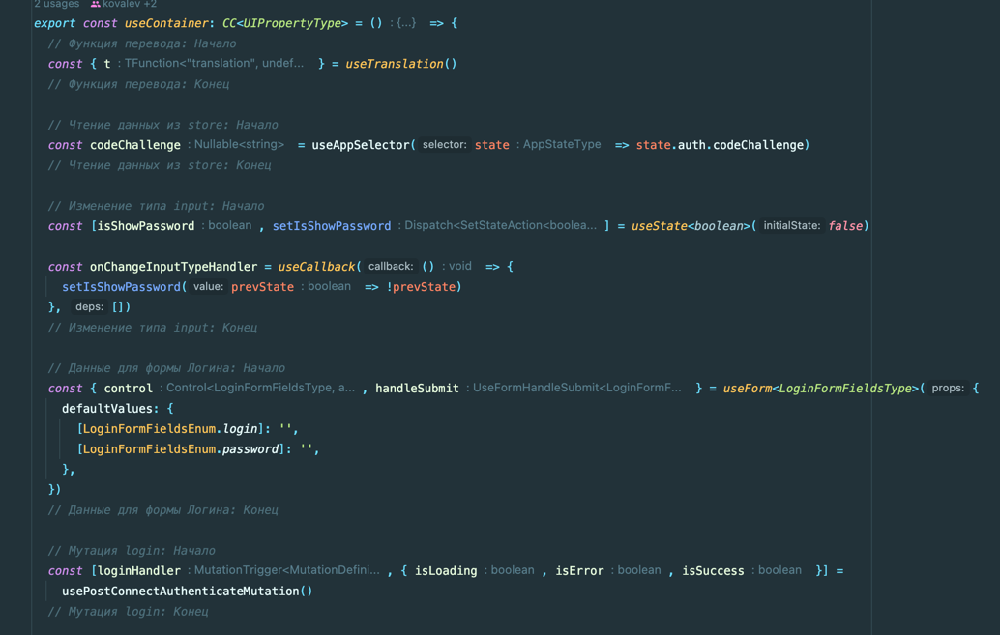
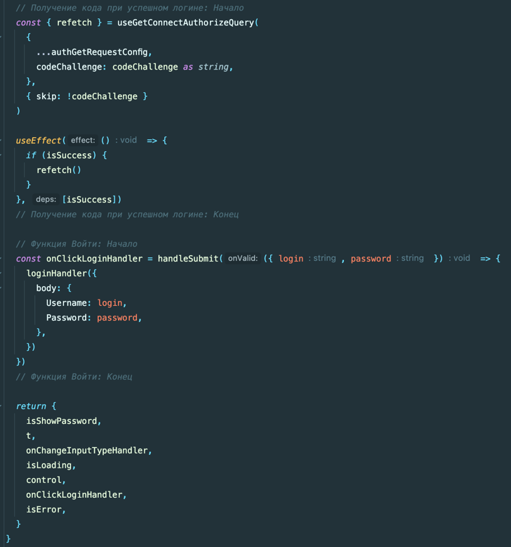
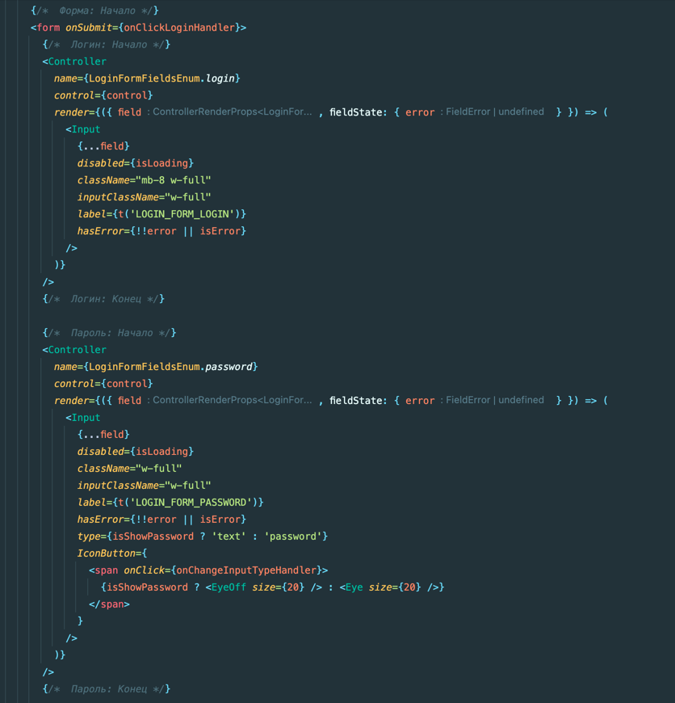

### Хороший код - это код, который не отличается от соседнего файла

> 1. Функции обработчики событий именуем как on***Handler.
> 2. Типизация функций:
> ```typescript jsx
> type OwnPropertyType = {
>   onChangeHandler: VoidFunction
>   onClickCloseButtonHandler: Callback
>   onSubmitHandler: Callback<string>
>   onDeleteHandler: Callback<string, string>
> }
> ```

> 3. Все логические блоки и блоки верстки комментируются:
> ```jsx
> // Логический блок: Начало
> { code }
> // Логический блок: Конец
> ```

<details>
    <summary>
      Пример комментариев
    </summary>




</details>

> 4. Использования хуков и функций в компонентах UI запрещено.

> 5. Импорт типов допустим только в папку Types.


