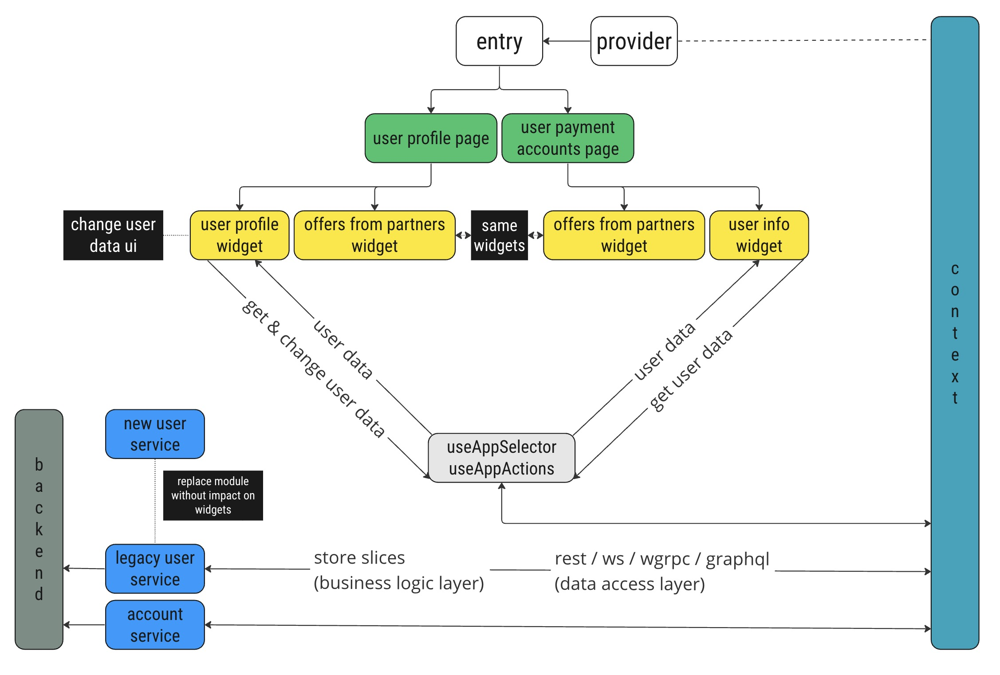

# Архитектура

> Основой архитектуры является **_"Вертикальный Срез"_** _(Vertical Slice)_ , сочетающая преимущества _**Feature Slice Design**_ _(FSD)_ и _**Слоеной архитектуры**_ _**(Layered Architecture)**_. Вертикальные срезы повышают модульность, упрощают навигацию по коду и ограничивают изменения в рамках одной фичи. Использование слоев обеспечивает разделение ответственности и упрощает тестирование и поддержку кода. В проекте показан пример на redux toolkit, но вы можете менять технологии как вам вздумается.



> Слой **_app_**: инициализация приложения.

> Слой **_generated_** заменяет 99% сервисов
>
> Для генерации хуков rtk-query используйте команду:
> ```
> yarn gen:hooks
> ```
> Скрипт автоматически добавит **_reducers_** и **_middleware_** в приложение.

> Слой **_service_**: отдельные логические реализации:
>
> Все **_service_** должны наименоваться с маленькой буквы в файле index.tsx, чтобы не было совпадений с _**widget**_.
> + **structure:** изначальное состояние slice;
> + **store:** настройка slice и actions;
> + **container:** реализация логики _(Файл useContainer нужен для модульного тестирования логики)_; 
> + **thunks:** _(необязательно)_  для каждой thunk свой файл, закидываются в export, а далее сами импортируются в store ';
> + **api:** _(необязательно)_  Data Access Layer;
> + **lib:** _(необязательно)_  utility функции, типизация;
> + **selectors:** _(необязательно)_  Реселекты для мемоизации бизнес логики.

> Слой **_widget_**: отдельные блоки приложения:
>
> Все **_widget_** должны именоваться с большой буквы в файле index.tsx, чтобы не было совпадений с **_service_**.
> + **container/useContainer.ts:** все side effects для ui, мемоизация логики _(Файл useContainer нужен для модульного тестирования логики)_;
> + **ui:** чистая компонента, отвечающая только за отрисовку;
> + **templates:** _(необязательно)_  декомпозиция UI для более простого масштабирования приложения в будущем;
> + **lib:** _(необязательно)_  utility функции;
> + **store:** _(необязательно)_  обычно используется для локального состояния загрузки или других процессов, которые зависят от других thunks;
> + **structure:** _(необязательно)_ изначальное состояние slice;
> + **constants:** _(необязательно)_ переменные для исключения магических чисел и строк (magic numbers).


> Слой **_layouts_**: верстка каркасов приложения.

> Слой **_pages_**: верстка страницы, объединяющая отдельные логические реализации.

> ## useAppActions
> Хук-адаптер позволяет доставать любые действия взаимодействия с **_store_**:
> ```javascript
> const { conditionActions: { enqueueNotification } } = useAppActions()
> ``` 
> Данная реализация позволяет **_изменять_** библиотеку управления состоянием без затрагивания компонент.

> ## useAppSelector
> Хук-адаптер позволяет подписываться на любые изменения store:
> ```javascript
> const { status } = useAppSelector(state => state.condition)
> ``` 
> Данная реализация позволяет **_изменять_** библиотеку управления состоянием без затрагивания компонент.


> ## Для генерации новых features
>
> В папке рядом с **_package.json_** вызвать команду из пакета **_@npm.piece/template-generator_**:
> ```
> new widget name
> new service name
> ```
> Команда автоматически добавит зависимости в хук _**useAppActions**_ и список **_ReducersList_**.
> ## Для удаления features
> ```
> remove widget name
> remove service name
> ```
> Команда автоматически удалит зависимости из хука _**useAppActions**_ и списка **_ReducersList_**.


> ## Docker
> #### Сборка docker-образа:
> ```
> docker build -t react_blank .
> ```
> #### Запуск docker-образа:
> ```
> docker run -p 8000:80 -d react_blank
> ```
> Проверяем http://localhost:8000/
> #### Остановка docker-образа:
> ```
> docker ps
> ```
> ```
> docker stop %CONTAINER ID% 
> ```
